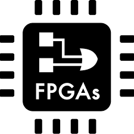

<h1 align="center">Hi there, I'm Sandra 👋</h1>

  🧠 Physicist turned Bioinformatician | 🔬 Marie Curie Doctoral Researcher | 🌌 Math, Physics, Algorithms & Graphs enthusiast

---

## 👩‍🔬 About Me

- 🎓 I’m a Physicist who wandered into the world of Bioinformatics (and stayed!)
- 🧪 Currently enrolled in a **Marie Curie Doctoral Project**
- 🧭 Passionate about combining **mathematical rigor** with **biological complexity**
- 📚 I explore **networks, algorithms, and data structures** — especially when applied to metabolism and biology
- 📫 Reach me at: **sandra.costa-gonzalez@inrae.fr** *(for now 😉)*

---

## 🧰 Languages and Tools

  <!-- Programming Languages -->
  
  
  
  
  
  
  

---

## 🔗 Connect with Me

  
 

---

<!---
SamSaladino/SamSaladino is a ✨ special ✨ repository because its `README.md` (this file) appears on your GitHub profile.
--->

##  💻 Tech Stack:

                       

## 📊 GitHub Stats:
 
 

---

<!-- Proudly created with GPRM ( https://gprm.itsvg.in ) -->